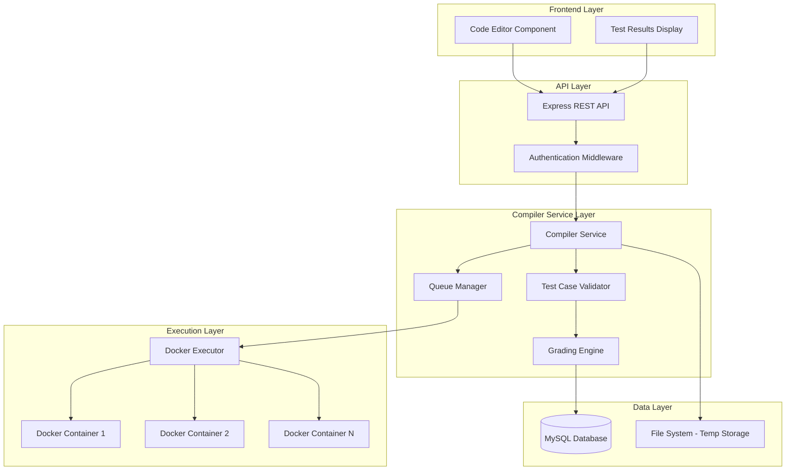

# Design Document: Multi-Language Code Compiler

## Overview

The Multi-Language Code Compiler is a secure, scalable system for compiling and executing student code submissions in seven programming languages. The architecture follows a microservices approach with three main layers:

1. **API Layer**: REST endpoints for code submission, compilation, and execution
2. **Compiler Service Layer**: Core business logic for managing compilation, execution, and grading
3. **Execution Layer**: Docker-based isolated containers for secure code execution

The system uses a queue-based architecture to manage concurrent executions, ensuring fair resource allocation and preventing server overload. All code executes in ephemeral Docker containers with strict resource limits and security sandboxing.

### Key Design Decisions

- **Docker for Isolation**: Each code execution runs in a fresh Docker container that is destroyed after completion, preventing any persistent security risks
- **Queue-Based Processing**: A FIFO queue with configurable concurrency limits ensures predictable performance under load
- **Language-Agnostic Interface**: A unified execution interface abstracts language-specific compilation and execution details
- **Separate Test Case Storage**: Test cases are stored independently from questions, allowing flexible test case management
- **Proportional Grading**: Marks are awarded based on the percentage of test cases passed, encouraging partial solutions

## Architecture

### System Components



### Data Flow

1. **Code Submission Flow**:
   - Student writes code in Code Editor
   - Frontend sends POST request to `/api/coding-questions/:id/submit`
   - API validates authentication and creates submission record
   - Compiler Service adds submission to Execution Queue
   - Queue Manager assigns submission to Docker Executor when capacity available
   - Docker Executor creates container, compiles (if needed), and executes code
   - Test Case Validator runs code against all test cases
   - Grading Engine calculates marks based on test results
   - Results are stored in database and returned to frontend

2. **Test Case Management Flow**:
   - Examiner creates test cases via POST `/api/test-cases`
   - Test cases stored in database with visibility flag
   - When student views question, only visible test cases are returned
   - During execution, all test cases (visible and hidden) are used for validation

## Components and Interfaces

### 1. Code Editor Component (Frontend)

**Purpose**: Provide a professional code editing experience with syntax highlighting and auto-save.

**Technology**: React with Monaco Editor (VS Code's editor) or CodeMirror

**Interface**:
```typescript
interface CodeEditorProps {
  questionId: number;
  initialCode: string;
  language: string;
  onCodeChange: (code: string) => void;
  onSubmit: (code: string, language: string) => Promise<void>;
  readOnly: boolean;
}

interface CodeEditorState {
  code: string;
  language: string;
  autoSaveStatus: 'saved' | 'saving' | 'unsaved';
}
```

**Key Methods**:
- `handleCodeChange(code: string)`: Updates code state and triggers auto-save
- `autoSave()`: Saves code to localStorage every 10 seconds
- `restoreCode()`: Loads previously saved code from localStorage
- `handleSubmit()`: Validates code and calls submission API

### 2. Compiler Service (Backend)

**Purpose**: Orchestrate code compilation, execution, and grading workflow.

**Interface**:
```javascript
class CompilerService {
  /**
   * Submit code for compilation and execution
   * @param {Object} submission - Code submission details
   * @param {number} submission.studentId - Student ID
   * @param {number} submission.codingQuestionId - Question ID
   * @param {string} submission.language - Programming language
   * @param {string} submission.code - Source code
   * @returns {Promise<Object>} Submission result with execution details
   */
  async submitCode(submission) {}
  
  /**
   * Compile code (for compiled languages)
   * @param {string} language - Programming language
   * @param {string} code - Source code
   * @param {string} workDir - Working directory path
   * @returns {Promise<Object>} Compilation result {success, errors, warnings}
   */
  async compile(language, code, workDir) {}
  
  /**
   * Execute code with test case input
   * @param {string} language - Programming language
   * @param {string} executablePath - Path to executable/script
   * @param {string} input - Test case input
   * @param {Object} limits - Resource limits {cpu, memory, timeout}
   * @returns {Promise<Object>} Execution result {output, error, exitCode, executionTime}
   */
  async execute(language, executablePath, input, limits) {}
  
  /**
   * Get language-specific configuration
   * @param {string} language - Programming language
   * @returns {Object} Language config {dockerImage, compileCmd, executeCmd, fileExtension}
   */
  getLanguageConfig(language) {}
}
```

### 3. Queue Manager (Backend)

**Purpose**: Manage concurrent code execution requests with FIFO ordering and capacity limits.

**Interface**:
```javascript
class QueueManager {
  constructor(maxConcurrent = 5) {
    this.queue = [];
    this.running = new Set();
    this.maxConcurrent = maxConcurrent;
  }
  
  /**
   * Add submission to execution queue
   * @param {Object} submission - Submission details
   * @returns {Promise<Object>} Execution result when complete
   */
  async enqueue(submission) {}
  
  /**
   * Process next item in queue if capacity available
   */
  async processNext() {}
  
  /**
   * Get current queue position for a submission
   * @param {number} submissionId - Submission ID
   * @returns {number} Queue position (0-indexed)
   */
  getQueuePosition(submissionId) {}
  
  /**
   * Get queue statistics
   * @returns {Object} Stats {queueLength, runningCount, averageWaitTime}
   */
  getStats() {}
}
```

### 4. Docker Executor (Backend)

**Purpose**: Create and manage Docker containers for secure code execution.

**Interface**:
```javascript
class DockerExecutor {
  /**
   * Execute code in isolated Docker container
   * @param {Object} config - Execution configuration
   * @param {string} config.language - Programming language
   * @param {string} config.code - Source code
   * @param {string} config.input - Test case input
   * @param {Object} config.limits - Resource limits
   * @returns {Promise<Object>} Execution result
   */
  async executeInContainer(config) {}
  
  /**
   * Create Docker container with security restrictions
   * @param {string} dockerImage - Docker image name
   * @param {string} workDir - Host working directory
   * @param {Object} limits - Resource limits
   * @returns {Promise<string>} Container ID
   */
  async createContainer(dockerImage, workDir, limits) {}
  
  /**
   * Run command in container
   * @param {string} containerId - Container ID
   * @param {string} command - Command to execute
   * @param {string} input - Stdin input
   * @returns {Promise<Object>} Command result {stdout, stderr, exitCode, executionTime}
   */
  async runCommand(containerId, command, input) {}
  
  /**
   * Destroy container and cleanup resources
   * @param {string} containerId - Container ID
   */
  async destroyContainer(containerId) {}
  
  /**
   * Copy file to container
   * @param {string} containerId - Container ID
   * @param {string} sourcePath - Host file path
   * @param {string} destPath - Container file path
   */
  async copyToContainer(containerId, sourcePath, destPath) {}
}
```

### 5. Test Case Validator (Backend)

**Purpose**: Run code against test cases and compare outputs.

**Interface**:
```javascript
class TestCaseValidator {
  /**
   * Validate code against all test cases
   * @param {number} submissionId - Submission ID
   * @param {number} questionId - Question ID
   * @param {Function} executeFunc - Function to execute code with input
   * @returns {Promise<Array>} Array of test results
   */
  async validateAllTestCases(submissionId, questionId, executeFunc) {}
  
  /**
   * Compare actual output with expected output
   * @param {string} expected - Expected output
   * @param {string} actual - Actual output
   * @returns {boolean} True if outputs match
   */
  compareOutputs(expected, actual) {}
  
  /**
   * Normalize output for comparison (trim whitespace, normalize line endings)
   * @param {string} output - Raw output
   * @returns {string} Normalized output
   */
  normalizeOutput(output) {}
  
  /**
   * Get test cases for a question
   * @param {number} questionId - Question ID
   * @param {boolean} includeHidden - Whether to include hidden test cases
   * @returns {Promise<Array>} Array of test cases
   */
  async getTestCases(questionId, includeHidden) {}
}
```

### 6. Grading Engine (Backend)

**Purpose**: Calculate marks based on test case results.

**Interface**:
```javascript
class GradingEngine {
  /**
   * Calculate marks for a submission
   * @param {number} submissionId - Submission ID
   * @param {Array} testResults - Array of test results
   * @param {number} totalMarks - Total marks for the question
   * @returns {Promise<Object>} Grading result {marksObtained, percentage, status}
   */
  async gradeSubmission(submissionId, testResults, totalMarks) {}
  
  /**
   * Calculate proportional marks
   * @param {number} passedTests - Number of passed tests
   * @param {number} totalTests - Total number of tests
   * @param {number} totalMarks - Total marks available
   * @returns {number} Marks obtained
   */
  calculateProportionalMarks(passedTests, totalTests, totalMarks) {}
  
  /**
   * Update submission with grading results
   * @param {number} submissionId - Submission ID
   * @param {Object} gradingResult - Grading result
   */
  async updateSubmissionGrade(submissionId, gradingResult) {}
}
```

### 7. Language Configuration Module

**Purpose**: Provide language-specific compilation and execution commands.

**Configuration Structure**:
```javascript
const LANGUAGE_CONFIGS = {
  'C': {
    dockerImage: 'gcc:latest',
    fileExtension: '.c',
    compileCommand: 'gcc -o program program.c -Wall',
    executeCommand: './program',
    requiresCompilation: true,
  },
  'C++': {
    dockerImage: 'gcc:latest',
    fileExtension: '.cpp',
    compileCommand: 'g++ -o program program.cpp -Wall -std=c++17',
    executeCommand: './program',
    requiresCompilation: true,
  },
  'Java': {
    dockerImage: 'openjdk:17-slim',
    fileExtension: '.java',
    compileCommand: 'javac Main.java',
    executeCommand: 'java Main',
    requiresCompilation: true,
    mainClassName: 'Main',
  },
  'C#': {
    dockerImage: 'mcr.microsoft.com/dotnet/sdk:7.0',
    fileExtension: '.cs',
    compileCommand: 'dotnet build',
    executeCommand: 'dotnet run',
    requiresCompilation: true,
  },
  'Node.js': {
    dockerImage: 'node:18-alpine',
    fileExtension: '.js',
    executeCommand: 'node program.js',
    requiresCompilation: false,
  },
  'Python': {
    dockerImage: 'python:3.11-alpine',
    fileExtension: '.py',
    executeCommand: 'python3 program.py',
    requiresCompilation: false,
  },
  'JavaScript': {
    dockerImage: 'node:18-alpine',
    fileExtension: '.js',
    executeCommand: 'node program.js',
    requiresCompilation: false,
  },
};
```

## Data Models

### Test Cases Table

```sql
CREATE TABLE test_cases (
  id INT PRIMARY KEY AUTO_INCREMENT,
  codingQuestionId INT NOT NULL,
  input TEXT NOT NULL,
  expectedOutput TEXT NOT NULL,
  isVisible BOOLEAN DEFAULT FALSE,
  orderIndex INT DEFAULT 0,
  createdAt TIMESTAMP DEFAULT CURRENT_TIMESTAMP,
  updatedAt TIMESTAMP DEFAULT CURRENT_TIMESTAMP ON UPDATE CURRENT_TIMESTAMP,
  FOREIGN KEY (codingQuestionId) REFERENCES coding_questions(id) ON DELETE CASCADE,
  INDEX idx_question_visible (codingQuestionId, isVisible)
) ENGINE=InnoDB DEFAULT CHARSET=utf8mb4;
```

### Test Results Table

```sql
CREATE TABLE test_results (
  id INT PRIMARY KEY AUTO_INCREMENT,
  submissionId INT NOT NULL,
  testCaseId INT NOT NULL,
  passed BOOLEAN NOT NULL,
  actualOutput TEXT,
  executionTime DECIMAL(10, 2),
  errorMessage TEXT,
  createdAt TIMESTAMP DEFAULT CURRENT_TIMESTAMP,
  FOREIGN KEY (submissionId) REFERENCES coding_submissions(id) ON DELETE CASCADE,
  FOREIGN KEY (testCaseId) REFERENCES test_cases(id) ON DELETE CASCADE,
  INDEX idx_submission (submissionId)
) ENGINE=InnoDB DEFAULT CHARSET=utf8mb4;
```

### Updated Coding Submissions Table

```sql
ALTER TABLE coding_submissions
MODIFY COLUMN language ENUM('C', 'C++', 'Java', 'C#', 'Node.js', 'Python', 'JavaScript') NOT NULL;

ALTER TABLE coding_submissions
ADD COLUMN compilationError TEXT AFTER error,
ADD COLUMN totalTestCases INT DEFAULT 0 AFTER marksObtained,
ADD COLUMN passedTestCases INT DEFAULT 0 AFTER totalTestCases;
```

### Sequelize Models

**TestCase Model**:
```javascript
const TestCase = sequelize.define('TestCase', {
  id: {
    type: DataTypes.INTEGER,
    primaryKey: true,
    autoIncrement: true,
  },
  codingQuestionId: {
    type: DataTypes.INTEGER,
    allowNull: false,
    references: {
      model: 'coding_questions',
      key: 'id',
    },
  },
  input: {
    type: DataTypes.TEXT,
    allowNull: false,
  },
  expectedOutput: {
    type: DataTypes.TEXT,
    allowNull: false,
  },
  isVisible: {
    type: DataTypes.BOOLEAN,
    defaultValue: false,
  },
  orderIndex: {
    type: DataTypes.INTEGER,
    defaultValue: 0,
  },
}, {
  tableName: 'test_cases',
  timestamps: true,
});
```

**TestResult Model**:
```javascript
const TestResult = sequelize.define('TestResult', {
  id: {
    type: DataTypes.INTEGER,
    primaryKey: true,
    autoIncrement: true,
  },
  submissionId: {
    type: DataTypes.INTEGER,
    allowNull: false,
    references: {
      model: 'coding_submissions',
      key: 'id',
    },
  },
  testCaseId: {
    type: DataTypes.INTEGER,
    allowNull: false,
    references: {
      model: 'test_cases',
      key: 'id',
    },
  },
  passed: {
    type: DataTypes.BOOLEAN,
    allowNull: false,
  },
  actualOutput: {
    type: DataTypes.TEXT,
    allowNull: true,
  },
  executionTime: {
    type: DataTypes.DECIMAL(10, 2),
    allowNull: true,
  },
  errorMessage: {
    type: DataTypes.TEXT,
    allowNull: true,
  },
}, {
  tableName: 'test_results',
  timestamps: true,
  updatedAt: false,
});
```

### Model Associations

```javascript
// CodingQuestion has many TestCases
CodingQuestion.hasMany(TestCase, {
  foreignKey: 'codingQuestionId',
  as: 'testCases',
});
TestCase.belongsTo(CodingQuestion, {
  foreignKey: 'codingQuestionId',
  as: 'codingQuestion',
});

// CodingSubmission has many TestResults
CodingSubmission.hasMany(TestResult, {
  foreignKey: 'submissionId',
  as: 'testResults',
});
TestResult.belongsTo(CodingSubmission, {
  foreignKey: 'submissionId',
  as: 'submission',
});

// TestCase has many TestResults
TestCase.hasMany(TestResult, {
  foreignKey: 'testCaseId',
  as: 'results',
});
TestResult.belongsTo(TestCase, {
  foreignKey: 'testCaseId',
  as: 'testCase',
});
```


## Correctness Properties

*A property is a characteristic or behavior that should hold true across all valid executions of a system—essentially, a formal statement about what the system should do. Properties serve as the bridge between human-readable specifications and machine-verifiable correctness guarantees.*

### Property Reflection

After analyzing all acceptance criteria, I identified several areas of redundancy:

1. **Language Support Properties (1.1-1.7)**: These can be combined into a single comprehensive property that tests all languages rather than separate properties for each.

2. **Resource Limit Properties (3.1-3.7)**: Properties 3.4, 3.5, and 3.6 are redundant with 3.1, 3.2, and 3.3 - they test the same behavior (limits are enforced) just with different error messages. We can combine these into properties that verify both the limit enforcement AND the error reporting.

3. **Test Case Visibility Properties (4.4, 4.5, 4.6, 4.7)**: These can be combined into a single property about visibility flags controlling access.

4. **Compilation Workflow Properties (5.1-5.5)**: These describe a sequential workflow that can be tested as a single property about the compilation-then-execution sequence.

5. **Output Comparison Properties (7.4, 7.5, 7.6, 7.7)**: These can be combined into a single property about output normalization and comparison logic.

6. **Grading Properties (8.2, 8.3, 8.4, 8.5)**: Property 8.2 (proportional grading) subsumes 8.3, 8.4, and 8.5 as they're just specific cases of proportional grading.

7. **Test Case Data Preservation (20.3, 20.4, 20.5, 20.6)**: Property 20.3 (round-trip) subsumes the others if we test with data containing special characters, Unicode, and whitespace.

### Properties

**Property 1: Multi-language execution support**
*For any* valid program in any supported language (C, C++, Java, C#, Node.js, Python, JavaScript), the Compiler_Service should successfully compile (if needed) and execute the program, returning the output.
**Validates: Requirements 1.1, 1.2, 1.3, 1.4, 1.5, 1.6, 1.7, 1.9**

**Property 2: Language runtime selection**
*For any* code submission, the Compiler_Service should use the Language_Runtime that matches the selected language field.
**Validates: Requirements 1.9**

**Property 3: Container isolation per execution**
*For any* code execution, a new Docker_Container should be created before execution and destroyed after completion.
**Validates: Requirements 2.1, 2.5**

**Property 4: Network access prevention**
*For any* code that attempts network operations, the execution should fail with a network access error.
**Validates: Requirements 2.2**

**Property 5: Filesystem security**
*For any* code execution, attempts to write to system directories should fail, while writes to the working directory should succeed.
**Validates: Requirements 2.3, 2.4**

**Property 6: Environment variable protection**
*For any* code that attempts to read sensitive environment variables, those variables should not be accessible.
**Validates: Requirements 2.6**

**Property 7: System command prevention**
*For any* code that attempts to execute dangerous system commands, the execution should be blocked or fail.
**Validates: Requirements 2.7**

**Property 8: CPU time limit enforcement**
*For any* code that consumes more than 10 seconds of CPU time, execution should be terminated and a timeout error should be returned with the reason recorded.
**Validates: Requirements 3.1, 3.4, 3.7**

**Property 9: Memory limit enforcement**
*For any* code that attempts to allocate more than 256 MB of memory, execution should be terminated and a memory limit error should be returned with the reason recorded.
**Validates: Requirements 3.2, 3.5, 3.7**

**Property 10: Execution timeout enforcement**
*For any* code that runs longer than 15 seconds, execution should be terminated and a timeout error should be returned with the reason recorded.
**Validates: Requirements 3.3, 3.6, 3.7**

**Property 11: Test case creation validation**
*For any* attempt to create a Test_Case without both input and expected output, the creation should fail with a validation error.
**Validates: Requirements 4.3**

**Property 12: Test case visibility control**
*For any* Test_Case, if created as a Sample_Test_Case then isVisible should be true, if created as Hidden_Test_Case then isVisible should be false, and students should only see test cases where isVisible is true.
**Validates: Requirements 4.4, 4.5, 4.6, 4.7**

**Property 13: Multiple test cases per question**
*For any* coding question, the system should support storing and retrieving multiple Test_Cases associated with that question.
**Validates: Requirements 4.10**

**Property 14: Compilation before execution**
*For any* code in a compiled language (C, C++, Java, C#), compilation should be attempted first, and if compilation fails, execution should be skipped and compilation errors should be returned.
**Validates: Requirements 5.1, 5.2, 5.3, 5.4, 5.5**

**Property 15: Compiler warnings inclusion**
*For any* code that generates compiler warnings, those warnings should be included in the compilation output.
**Validates: Requirements 5.6**

**Property 16: Output and error capture**
*For any* code execution, all stdout and stderr output should be captured and returned, along with execution time in milliseconds.
**Validates: Requirements 6.1, 6.2, 6.3, 6.4**

**Property 17: Runtime error capture**
*For any* code that throws a runtime error, the error message and stack trace should be captured and the status should be set to Runtime_Error.
**Validates: Requirements 6.5, 6.6**

**Property 18: Output size limiting**
*For any* code that produces more than 10,000 characters of output, the output should be truncated to 10,000 characters with a truncation indicator appended.
**Validates: Requirements 6.7, 6.8**

**Property 19: Test case execution**
*For any* successful code execution, the code should be run against all Test_Cases with each test case's input provided via stdin.
**Validates: Requirements 7.1, 7.2**

**Property 20: Output comparison with normalization**
*For any* test case output comparison, leading/trailing whitespace and line ending differences (CRLF vs LF) should be ignored, and the result should be marked as passed if normalized outputs match, failed otherwise.
**Validates: Requirements 7.3, 7.4, 7.5, 7.6, 7.7**

**Property 21: Test result persistence**
*For any* test case execution, the result (passed/failed) should be recorded in the database with the actual output.
**Validates: Requirements 7.8**

**Property 22: Test result visibility**
*For any* code submission, Sample_Test_Case results should be returned immediately to the student, while Hidden_Test_Case results should not be returned until grading is complete.
**Validates: Requirements 7.9, 7.10**

**Property 23: Proportional grading**
*For any* code submission, marks should be calculated as (passedTests / totalTests) × totalMarks, where 0% pass rate gives 0 marks and 100% pass rate gives full marks.
**Validates: Requirements 8.1, 8.2, 8.3, 8.4, 8.5**

**Property 24: Grade persistence and status update**
*For any* completed grading, the calculated marks should be stored in the Code_Submission record and the status should be updated to "Graded".
**Validates: Requirements 8.6, 8.7**

**Property 25: Comprehensive grading**
*For any* grading calculation, both Sample_Test_Cases and Hidden_Test_Cases should be included in the marks calculation.
**Validates: Requirements 8.8**

**Property 26: Test result data completeness**
*For any* test execution, the results should include which tests passed/failed, and for failed tests, both expected and actual output should be included along with execution time.
**Validates: Requirements 9.4, 9.5, 9.6**

**Property 27: Marks in response**
*For any* graded submission, the final marks obtained should be included in the API response.
**Validates: Requirements 9.7**

**Property 28: Queue position reporting**
*For any* queued execution, the queue position should be included in the API response.
**Validates: Requirements 9.8**

**Property 29: Queue addition**
*For any* code submission, it should be added to the Execution_Queue before processing.
**Validates: Requirements 10.1**

**Property 30: FIFO queue processing**
*For any* sequence of code submissions, they should be processed in the order they were submitted (first-in, first-out).
**Validates: Requirements 10.2**

**Property 31: Concurrent execution limit**
*For any* point in time, the number of simultaneously running Docker_Containers should not exceed 5.
**Validates: Requirements 10.3**

**Property 32: Queue progression**
*For any* completed execution, the next queued execution should start immediately if the queue is not empty.
**Validates: Requirements 10.4**

**Property 33: Queue position updates**
*For any* execution in the queue, its position should decrease by 1 when an execution ahead of it completes.
**Validates: Requirements 10.6**

**Property 34: Queue overflow rejection**
*For any* submission attempt when the queue has 50 or more pending executions, the submission should be rejected with a "Server busy" message.
**Validates: Requirements 10.7**

**Property 35: Code editor auto-save**
*For any* code being edited, it should be saved to local storage at least every 10 seconds.
**Validates: Requirements 12.11**

**Property 36: Code restoration**
*For any* student returning to a question, if code was previously saved in local storage, it should be restored to the editor.
**Validates: Requirements 12.12**

**Property 37: Container mount restrictions**
*For any* Docker_Container created, only the code file and input data should be mounted, with no access to other host files.
**Validates: Requirements 13.8**

**Property 38: Container resource configuration**
*For any* Docker_Container created, it should be configured with the specified CPU, memory, and timeout limits.
**Validates: Requirements 13.9**

**Property 39: Container network disabled**
*For any* Docker_Container created, network access should be disabled in the container configuration.
**Validates: Requirements 13.10**

**Property 40: Container failure logging**
*For any* Docker_Container that fails to start, an error should be logged with timestamp and failure details.
**Validates: Requirements 14.1**

**Property 41: Execution failure logging**
*For any* code execution that fails, the failure reason and submission ID should be logged.
**Validates: Requirements 14.2**

**Property 42: Timeout logging**
*For any* execution that times out, the execution time and resource usage should be logged.
**Validates: Requirements 14.3**

**Property 43: Compilation error logging**
*For any* compilation error, the error and submission ID should be logged.
**Validates: Requirements 14.4**

**Property 44: Container cleanup failure logging**
*For any* Docker_Container that cannot be destroyed, a critical error should be logged and cleanup should be attempted.
**Validates: Requirements 14.6**

**Property 45: Security violation logging**
*For any* security violation (network access attempt, filesystem violation), the violation should be logged with details.
**Validates: Requirements 14.7**

**Property 46: Line ending compatibility**
*For any* code with Windows line endings (CRLF), it should execute correctly in Linux containers with LF line endings.
**Validates: Requirements 15.5**

**Property 47: Windows path conversion**
*For any* file mount on Windows, the path should be correctly converted to a format compatible with Docker containers.
**Validates: Requirements 15.6**

**Property 48: Test case format support**
*For any* test case with plain text input/output (including multi-line, empty, or containing newlines), the system should correctly store and use the data.
**Validates: Requirements 17.1, 17.2, 17.3, 17.4, 17.7**

**Property 49: Stdin/stdout mechanism**
*For any* test case execution, input should be provided via stdin and output should be captured from stdout.
**Validates: Requirements 17.5, 17.6**

**Property 50: Test result formatting**
*For any* test execution, results should include clear labels for each test case, and failed tests should include input, expected output, and actual output.
**Validates: Requirements 19.1, 19.2**

**Property 51: Test result summary**
*For any* test execution, a summary should be included showing total tests, passed tests, failed tests, and execution time for each test.
**Validates: Requirements 19.4, 19.5**

**Property 52: Test case data round-trip**
*For any* Test_Case containing special characters, Unicode, or various whitespace characters, saving to the database and then retrieving should produce equivalent data.
**Validates: Requirements 20.3, 20.4, 20.5, 20.6**

## Error Handling

### Compilation Errors

**Strategy**: Capture all compiler output (stdout and stderr) and return to the user with clear formatting.

**Error Types**:
- Syntax errors: Parse errors, missing semicolons, unmatched brackets
- Type errors: Type mismatches, undefined variables
- Linker errors: Missing libraries, undefined references

**Handling**:
```javascript
try {
  const compileResult = await compile(language, code, workDir);
  if (!compileResult.success) {
    return {
      status: 'Compilation_Error',
      compilationError: compileResult.errors,
      warnings: compileResult.warnings,
    };
  }
} catch (error) {
  logger.error('Compilation failed', { submissionId, error });
  return {
    status: 'Compilation_Error',
    compilationError: 'Internal compilation error occurred',
  };
}
```

### Runtime Errors

**Strategy**: Capture stderr and exit codes to identify runtime failures.

**Error Types**:
- Segmentation faults: Memory access violations
- Null pointer exceptions: Accessing null/undefined
- Array index out of bounds: Invalid array access
- Stack overflow: Infinite recursion
- Division by zero: Arithmetic errors

**Handling**:
```javascript
try {
  const execResult = await execute(language, executable, input, limits);
  if (execResult.exitCode !== 0) {
    return {
      status: 'Runtime_Error',
      error: execResult.stderr,
      exitCode: execResult.exitCode,
    };
  }
} catch (error) {
  logger.error('Execution failed', { submissionId, error });
  return {
    status: 'Runtime_Error',
    error: 'Code execution failed',
  };
}
```

### Resource Limit Errors

**Strategy**: Monitor resource usage and terminate execution when limits are exceeded.

**Error Types**:
- CPU timeout: Exceeded 10 seconds CPU time
- Memory limit: Exceeded 256 MB memory
- Execution timeout: Exceeded 15 seconds wall time

**Handling**:
```javascript
const limits = {
  cpuTime: 10000, // milliseconds
  memory: 256 * 1024 * 1024, // bytes
  timeout: 15000, // milliseconds
};

// Docker run with limits
const dockerCmd = `docker run --rm \
  --cpus="1.0" \
  --memory="256m" \
  --network=none \
  --timeout=${limits.timeout}ms \
  ${dockerImage} ${command}`;

// Handle timeout
if (execResult.timedOut) {
  return {
    status: 'Timeout',
    error: 'Execution exceeded time limit',
    executionTime: limits.timeout,
  };
}

// Handle memory limit
if (execResult.memoryExceeded) {
  return {
    status: 'Memory_Limit_Exceeded',
    error: 'Code exceeded memory limit',
  };
}
```

### Docker Errors

**Strategy**: Gracefully handle Docker failures and provide fallback mechanisms.

**Error Types**:
- Container creation failure: Docker daemon not running, image not found
- Container execution failure: Command not found, permission denied
- Container cleanup failure: Container stuck, cannot remove

**Handling**:
```javascript
try {
  const containerId = await createContainer(dockerImage, workDir, limits);
  
  try {
    const result = await runCommand(containerId, command, input);
    return result;
  } finally {
    // Always attempt cleanup
    try {
      await destroyContainer(containerId);
    } catch (cleanupError) {
      logger.critical('Container cleanup failed', { containerId, cleanupError });
      // Attempt force removal
      await forceRemoveContainer(containerId);
    }
  }
} catch (error) {
  logger.error('Docker operation failed', { error });
  return {
    status: 'System_Error',
    error: 'Code execution system temporarily unavailable',
  };
}
```

### Queue Errors

**Strategy**: Implement queue overflow protection and timeout handling.

**Error Types**:
- Queue overflow: More than 50 pending executions
- Queue timeout: Execution waited too long in queue

**Handling**:
```javascript
async enqueue(submission) {
  if (this.queue.length >= 50) {
    throw new Error('Server busy - too many pending executions');
  }
  
  const queueEntry = {
    submission,
    enqueuedAt: Date.now(),
    promise: null,
  };
  
  queueEntry.promise = new Promise((resolve, reject) => {
    queueEntry.resolve = resolve;
    queueEntry.reject = reject;
    
    // Timeout after 5 minutes in queue
    setTimeout(() => {
      const index = this.queue.indexOf(queueEntry);
      if (index !== -1) {
        this.queue.splice(index, 1);
        reject(new Error('Execution timed out in queue'));
      }
    }, 5 * 60 * 1000);
  });
  
  this.queue.push(queueEntry);
  this.processNext();
  
  return queueEntry.promise;
}
```

### Database Errors

**Strategy**: Use transactions for data consistency and retry logic for transient failures.

**Error Types**:
- Connection errors: Database unavailable
- Constraint violations: Foreign key violations, unique constraints
- Transaction deadlocks: Concurrent access conflicts

**Handling**:
```javascript
async function saveTestResults(submissionId, testResults) {
  const transaction = await sequelize.transaction();
  
  try {
    // Save all test results in transaction
    for (const result of testResults) {
      await TestResult.create({
        submissionId,
        testCaseId: result.testCaseId,
        passed: result.passed,
        actualOutput: result.actualOutput,
        executionTime: result.executionTime,
      }, { transaction });
    }
    
    // Update submission with totals
    await CodingSubmission.update({
      totalTestCases: testResults.length,
      passedTestCases: testResults.filter(r => r.passed).length,
      status: 'Graded',
    }, {
      where: { id: submissionId },
      transaction,
    });
    
    await transaction.commit();
  } catch (error) {
    await transaction.rollback();
    logger.error('Failed to save test results', { submissionId, error });
    throw error;
  }
}
```

## Testing Strategy

### Dual Testing Approach

The system requires both unit tests and property-based tests for comprehensive coverage:

- **Unit tests**: Verify specific examples, edge cases, and error conditions
- **Property tests**: Verify universal properties across all inputs

Together, these provide comprehensive coverage where unit tests catch concrete bugs and property tests verify general correctness.

### Property-Based Testing

**Library**: Use `fast-check` for JavaScript/Node.js property-based testing

**Configuration**: Each property test should run a minimum of 100 iterations to ensure thorough randomized testing.

**Test Tagging**: Each property test must include a comment tag referencing the design document property:
```javascript
// Feature: code-compiler, Property 1: Multi-language execution support
```

**Example Property Test**:
```javascript
const fc = require('fast-check');

// Feature: code-compiler, Property 23: Proportional grading
test('marks are proportional to test pass rate', async () => {
  await fc.assert(
    fc.asyncProperty(
      fc.integer({ min: 0, max: 20 }), // total tests
      fc.integer({ min: 0, max: 100 }), // total marks
      async (totalTests, totalMarks) => {
        fc.pre(totalTests > 0); // Skip if no tests
        
        // Test all possible pass rates
        for (let passedTests = 0; passedTests <= totalTests; passedTests++) {
          const expectedMarks = (passedTests / totalTests) * totalMarks;
          const actualMarks = await gradingEngine.calculateProportionalMarks(
            passedTests,
            totalTests,
            totalMarks
          );
          
          expect(actualMarks).toBeCloseTo(expectedMarks, 2);
        }
      }
    ),
    { numRuns: 100 }
  );
});
```

### Unit Testing

**Focus Areas**:
- Specific language compilation commands
- Edge cases (empty input, empty output, special characters)
- Error conditions (compilation failures, runtime errors)
- Integration between components

**Example Unit Tests**:
```javascript
describe('CompilerService', () => {
  test('should compile valid C code', async () => {
    const code = '#include <stdio.h>\nint main() { printf("Hello"); return 0; }';
    const result = await compilerService.compile('C', code, '/tmp/test');
    expect(result.success).toBe(true);
  });
  
  test('should capture compilation errors for invalid C code', async () => {
    const code = 'int main() { invalid syntax }';
    const result = await compilerService.compile('C', code, '/tmp/test');
    expect(result.success).toBe(false);
    expect(result.errors).toContain('error');
  });
  
  test('should handle empty test case input', async () => {
    const testCase = { input: '', expectedOutput: 'Hello' };
    const result = await testCaseValidator.validateTestCase(testCase, executeFunc);
    expect(result).toBeDefined();
  });
});
```

### Integration Testing

**Focus Areas**:
- End-to-end code submission flow
- Docker container lifecycle
- Queue processing under load
- Database transactions

**Example Integration Test**:
```javascript
describe('Code Submission Flow', () => {
  test('should execute code and grade submission', async () => {
    // Create test question and test cases
    const question = await CodingQuestion.create({
      title: 'Sum Two Numbers',
      marks: 10,
    });
    
    await TestCase.create({
      codingQuestionId: question.id,
      input: '5 10',
      expectedOutput: '15',
      isVisible: true,
    });
    
    // Submit code
    const code = 'a, b = map(int, input().split())\nprint(a + b)';
    const submission = await compilerService.submitCode({
      studentId: 1,
      codingQuestionId: question.id,
      language: 'Python',
      code,
    });
    
    // Verify grading
    expect(submission.status).toBe('Graded');
    expect(submission.marksObtained).toBe(10);
    expect(submission.passedTestCases).toBe(1);
  });
});
```

### Security Testing

**Focus Areas**:
- Network access prevention
- Filesystem restrictions
- Resource limit enforcement
- Environment variable protection

**Example Security Tests**:
```javascript
describe('Security', () => {
  test('should block network access', async () => {
    const code = `
      import socket
      s = socket.socket()
      s.connect(('google.com', 80))
    `;
    const result = await compilerService.execute('Python', code, '', limits);
    expect(result.status).toBe('Runtime_Error');
    expect(result.error).toContain('network');
  });
  
  test('should prevent system file writes', async () => {
    const code = `
      with open('/etc/passwd', 'w') as f:
        f.write('hacked')
    `;
    const result = await compilerService.execute('Python', code, '', limits);
    expect(result.status).toBe('Runtime_Error');
    expect(result.error).toContain('Permission denied');
  });
});
```

### Performance Testing

**Focus Areas**:
- Queue throughput under load
- Container creation/destruction time
- Concurrent execution handling
- Database query performance

**Example Performance Test**:
```javascript
describe('Performance', () => {
  test('should handle 50 concurrent submissions', async () => {
    const submissions = Array(50).fill(null).map((_, i) => ({
      studentId: i,
      codingQuestionId: 1,
      language: 'Python',
      code: 'print("Hello")',
    }));
    
    const startTime = Date.now();
    const results = await Promise.all(
      submissions.map(s => compilerService.submitCode(s))
    );
    const duration = Date.now() - startTime;
    
    expect(results.every(r => r.status === 'Graded')).toBe(true);
    expect(duration).toBeLessThan(60000); // Should complete within 1 minute
  });
});
```
